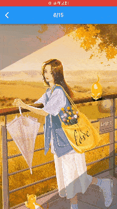

<a href="https://flutter.dev/">
  <h1 align="center">
    <picture>
      <source media="(prefers-color-scheme: dark)" srcset="https://storage.googleapis.com/cms-storage-bucket/6e19fee6b47b36ca613f.png">
      
    </picture>
  </h1>
</a>

<h2> [pub.dev](https://pub.dev/packages) </h2>

## Contents

- :boom: [Device Info](#deviceInfo)
- :video_camera: [Videoplayer](#videoplayer)
- :play_or_pause_button:  [Audioplayer](#audioplayer)
- :pencil2: [Signaturepad](#signaturepad)
- :framed_picture: [Image](#image)
- :globe_with_meridians: [Skeleton screen](#skeletonScreen)
- :sweet_potato: [Refresh](#refresh)
- :eggplant: [Download](#download)
- :tomato: [Menu](#menu)
- :green_apple: [screen](#screen)
- :banana: [Animated](#animated)
- :melon: [Drawer](#drawer)
- :grapes: [SMS code](#sMSCode)
- :pineapple: [Form](#form)
- :watermelon: [Paginated](#paginated)
- :cherries: [Toolkit](#toolkit)
- :lollipop: [Datetime](#datetime)
- :sparkles: [Mobile Upgrader](#mobileUpgrader)
- :dizzy: [Dialog](#dialog)
- :star2: [Toast](#toast)
- :star: [Swiper](#swiper)
- :star: [Slider](#slider)
- :star: [Calendar](#calendar)
- :star: [Scan](#scan)
- :star: [Login](#login)
- :star: [List](#list)
- :star: [Charts](#charts)
- :star: [Grid](#grid)
- :heart: [Other](#other)

## DeviceInfo

## Videoplayer 

- [flutter_meedu_videoplayer](https://pub.dev/packages/flutter_meedu_videoplayer)

- [pod_player](https://pub.dev/packages/pod_player)

## audioplayer

- [assets_audio_player](https://pub.dev/packages/assets_audio_player)

- [assets_audio_player](https://pub.dev/packages/assets_audio_player)

## Signaturepad

- [syncfusion_flutter_signaturepad](https://pub.dev/packages/syncfusion_flutter_signaturepad)

## Image

- [gallery_camera_image_picker_view](https://pub.dev/packages/gallery_camera_image_picker_view)

- [profile_view](https://pub.dev/packages/profile_view)

- [hl_image_picker_android](https://pub.dev/packages/hl_image_picker_android)

- [hl_image_picker](https://pub.dev/packages/hl_image_picker)

- [image_crop_plus_updated](https://pub.dev/packages/image_crop_plus_updated)

- [photo_view_x](https://pub.dev/packages/photo_view_x)

- [custom_image_crop](https://pub.dev/packages/custom_image_crop)

- [interactive_gallery](https://pub.dev/packages/interactive_gallery)

## SkeletonScreen

- [awesome_extensions](https://pub.dev/packages/awesome_extensions)

- [skeletonizer](https://pub.dev/packages/skeletonizer)

## Refresh

- [pull_refresh_widget](https://pub.dev/packages/pull_refresh_widget)

## Download

- [easy_downloader](https://pub.dev/packages/easy_downloader)

## Menu

- [fab_circular_menu_plus](https://pub.dev/packages/fab_circular_menu_plus)

## Screen

- [flutter_splash_screen](https://pub.dev/packages/flutter_splash_screen)

## Animated

- [animated_flip_counter](https://pub.dev/packages/animated_flip_counter)

- [flutter_animate](https://pub.dev/packages/flutter_animate)

- [animated_rating_stars](https://pub.dev/packages/animated_rating_stars)

- [another_flutter_splash_screen](https://pub.dev/packages/another_flutter_splash_screen)

- [animate_do](https://pub.dev/packages/animate_do)

- [animated_flutter_widgets](https://pub.dev/packages/animated_flutter_widgets)

- [animations](https://pub.dev/packages/animations)

- [animated_theme_switcher](https://pub.dev/packages/animated_theme_switcher)

## Drawer

- [sidebarx](https://pub.dev/packages/sidebarx)

## SMSCode

- [pinput](https://pub.dev/packages/pinput)

## Form

[flutter_form_fields](https://pub.dev/packages/flutter_form_fields)

- [elevarm_ui](https://pub.dev/packages/elevarm_ui)

- [city_pickers](https://pub.dev/packages/city_pickers)

## Paginated

- [enhanced_paginated_view](https://pub.dev/packages/enhanced_paginated_view)

## Toolkit

- [widget_toolkit](https://pub.dev/packages/widget_toolkit)

## Datetime

- [board_datetime_picker](https://pub.dev/packages/board_datetime_picker)

## mobileUpgrader

- [flutter_mobile_upgrader](https://pub.dev/packages/flutter_mobile_upgrader)

## dialog

- [ndialog](https://pub.dev/packages/ndialog)

## toast

- [info_toast](https://pub.dev/packages/info_toast)

## swiper

- [appinio_swiper](https://pub.dev/packages/appinio_swiper)

## slider

- [flutter_onboarding_slider](https://pub.dev/packages/flutter_onboarding_slider)

- [diamond_node_slider](https://pub.dev/packages/diamond_node_slider)

- [intro_slider](https://pub.dev/packages/intro_slider)

## calendar

- [calendar_date_picker2](https://pub.dev/packages/calendar_date_picker2)

## scan

- [flutter_barcode_sdk](https://pub.dev/packages/flutter_barcode_sdk)

## login

- [flutter_login_fix](https://pub.dev/packages/flutter_login_fix)

- [flutter_login](https://pub.dev/packages/flutter_login)

## list

- [infinite_grouped_list](https://pub.dev/packages/infinite_grouped_list)

## charts

- [flutter_chart_plus](https://pub.dev/packages/flutter_chart_plus)

## grid

- [flutter_super_grid](https://pub.dev/packages/flutter_super_grid)

## other

- [chatview](https://pub.dev/packages/chatview)

- [responsive_navigation_bar](https://pub.dev/packages/responsive_navigation_bar)

